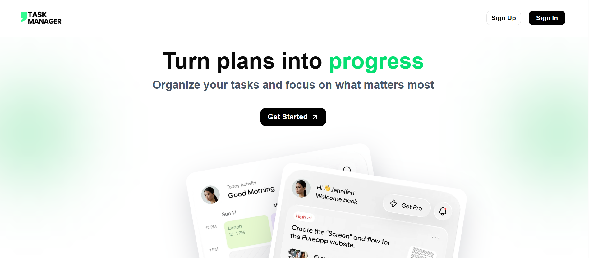
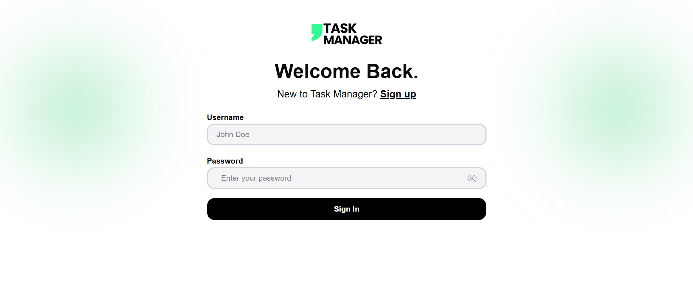
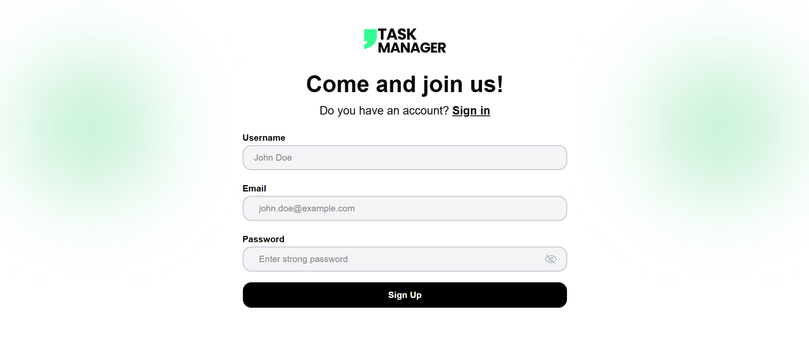
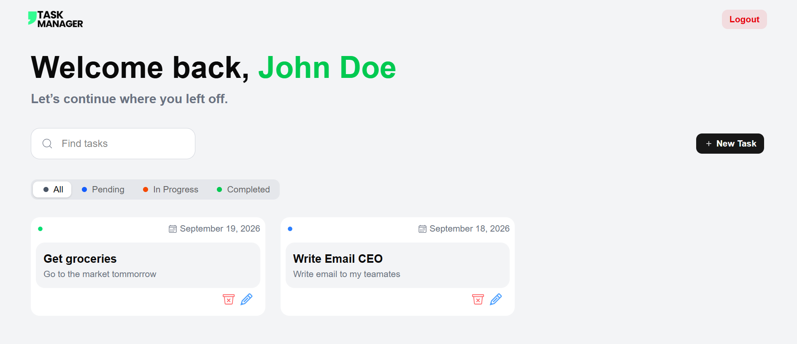

# Task Manager

Modern task management application built with a separate frontend/backend architecture. It allows users to manage tasks, sign up, log in, and access a personal workspace with authentication and real-time task management.

## Project overview

The project consists of:

- a React + Vite + TypeScript frontend for the user interface
- a Spring Boot + Java backend for the REST API
- a MySQL database for storing application data
- secure JWT-based authentication
- Docker configuration for easier deployment

## Features

- User registration and login
- JWT authentication
- Create, view, search, and delete tasks
- Responsive and modern interface
- Error handling and user feedback

## Screenshots

### Home page



### Login



### Register



### Task board



---

## Prerequisites

Before starting the project, make sure you have installed:

- Docker
- Docker Compose

## Installation

### 1. Clone the project

```bash
git clone https://github.com/yann-fk-21/taskmanager.git
cd task-manager
```

### 2. Start the backend + MySQL with Docker Compose

```bash
cd ./backend
docker compose up --build
```

### 3. Build and run the frontend with Docker

```bash
cd ./frontend
docker build -t frontend-task-manager .
docker run -d -p 80:80 --name frontend-task-manager frontend-task-manager
```

This starts:

- MySQL
- the Spring Boot backend
- the React frontend served by Nginx

---

## Running the app

The application is started in two separate Docker steps:

### 1) Backend + MySQL

```bash
cd ./backend
docker compose up --build
```

### 2) Frontend

```bash
cd ./frontend
docker build -t frontend-task-manager .
docker run -d -p 80:80 --name frontend-task-manager frontend-task-manager
```

### Access the application

- Frontend: http://localhost
- Backend: http://localhost:8080
- MySQL database: localhost:3306

### Stop the services

```bash
docker compose down
```

For the frontend:

```bash
docker stop frontend-task-manager
docker rm frontend-task-manager
```

To remove MySQL volumes as well:

```bash
docker compose down -v
```

---

## Technical architecture

### Frontend

- React 19
- Vite
- TypeScript
- React Router
- Tailwind CSS
- Shadcn UI / custom components
- JWT token handling in the browser

The frontend is responsible for:

- authentication
- form management
- task display
- search and user interactions

### Backend

- Java 17
- Spring Boot 4.1.1
- Spring Web MVC
- Spring Data JPA
- Spring Security
- MySQL Connector
- JWT (jjwt)

The backend exposes a secure REST API for:

- sign up / login
- creating and retrieving tasks
- permission management and authentication

### Database

- MySQL 8
- stores users and tasks
- JPA configuration with automatic schema generation

### Security

- JWT authentication
- backend route protection
- frontend and backend input validation

---

## Tech stack

| Layer            | Technology              |
| ---------------- | ----------------------- |
| Frontend         | React, Vite, TypeScript |
| Styling          | Tailwind CSS            |
| Backend          | Spring Boot, Java 17    |
| Security         | Spring Security, JWT    |
| Database         | MySQL                   |
| Containerization | Docker                  |

---

## Project structure

```text
task-manager/
├── backend/                  # Spring Boot API
│   ├── src/
│   ├── Dockerfile
│   ├── compose.yaml
│   └── pom.xml
├── frontend/                 # React application
│   ├── src/
│   ├── Dockerfile
│   ├── package.json
│   └── vite.config.ts
├── docs-images/              # Screenshots
├── LICENSE
├── Readme.md
└── .gitignore
```

---

## License

This project is distributed under the MIT license. Please see the LICENSE file for more information.
